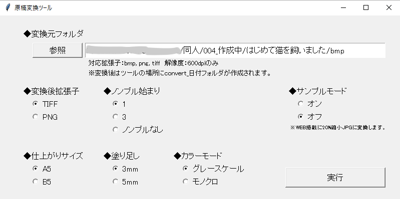
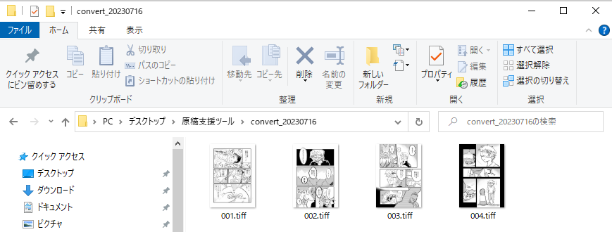

# 原稿支援ツール
このツールは、漫画原稿用紙をデジタル入稿形式に一発で変換するツールです。
環境構築不要のexe形式で使用することができます。

release配下の「原稿支援ツール.zip」を解凍して使用してください。

### 前提条件
対象のフォルダと画像の状態で以下を満たすこと。
* 対象の画像以外は入ってないこと。
* 対象の画像は解像度600dpiであること。
* 原稿は画像中央に配置されていること。
* 対象の画像拡張子は、OpenCVで対応してるものであること。
  　※BMP, PNG, TIFF, TIF

容量に余裕があればPNGよりもBMPが速いのでおすすめです。
また、__解像度だけは描いた後どうにもなりませんので絶対に要事前チェック！__

# なんで作ったの？
私の趣味である、漫画同人誌制作に活用しています。

同人誌を作るためには、死ぬ気で原稿を描いた後に、印刷所の入稿のフォーマットに合わせるという __ただただ面倒くさいだけの作業__ が発生します。

入稿ぎりぎりの仲間の方は、入稿作業間に合わない！！ってことで割増しになったり気力が途絶えて諦めてしまうこともあります。（※一部の声）

__もっと速く！負担なく！正確に！入稿作業自動化したい！！__ 
…と自動化への思いを募らせておりました。

正直なところ、クリスタと仲良くなれない人にしか需要がないニッチなツールですが、pythonの勉強がてら実現してみました。

# どこを自動化したの？
まずは今までやっていた作業内容をご紹介します。

私はSAI2というペイントソフトで、原稿テンプレートもはるか昔のものを使い続けています。
そんな私の超非効率な作業手順が以下です。↓　※（）内はファイル拡張子

1. 入稿作業（.sai2）
    1. ノンブル入力
    2. レイヤー表示・非表示設定
    3. 修正
2. エクスポート(.sai2→.bmp)
3. クリスタ作業
    1. トリミング
    2. カラーモード設定
    3. エクスポート(.sai2→.pngか.tiff)

これらは __大項目ごとにページ枚数分の繰り返しが必要__ となります。
つまり一冊100Pの漫画を作った日には、100回の編集&200回のエクスポート作業を手動で行わなければならない…

__あまりにも・・・あまりにも面倒くさい・・・・__ 

そして締め切りぎりぎりのプレッシャー、徹夜で死んでいる脳……
正確性も不安ですし、気がおかしくなります。（※状況には個人差があります）

# ツールを使った後の手順
そしてこれがどうなったのかというと。

1. 入稿作業（.sai2）
    1. ~~ノンブル入力~~
    1. レイヤー表示・非表示設定
    1. 修正
1. エクスポート(.bmp)
    1. ~~クリスタ作業(.pngか.tiff)~~
    2. ~~トリミング~~
    3. ~~カラーモード設定~~
    4. ~~エクスポート~~
1. ツール実行

__結論：約2/3の作業を自動化できました！__

BMP出力はSAI2依存の機能なので、自動化は難しかったです。

ただ、私的にはsai2の中でショートカットキーを設定してしまえば、そこまで大変な作業でもないので許せる範囲でした。（最終出力前の目視確認もしたかった）

# アプローチ
pythonの勉強をしたい＆最終的にはツール配布も視野に入れていたので、

__①pythonで機能実装　→　②GUIにする　→　③exe化する__

という流れで作ることにしました。

### ①pythonで機能実装
やりたいことリスト↓
>* トリミング　
>* 隠しノンブル入れ
>* グレースケール化
>* 拡張子変換（tiffかpng）

ちなみに、ノンブルとは本のページの隅っこに書いてあるページ数のことです。
隠しノンブルとは、本の割れ目に挟まってほぼ見えなくなる位置に入ってるノンブルのことです。

主にはOpenCVやPillowのライブラリを使用して実現できました。
こだわりは、ノンブル入れの時で背景色を判断して文字色を変えるようにしたこと。
背景色が黒っぽいと白文字で、白っぽいと黒文字で数字入れをしてくれます。

こんな感じで自動で文字色を変えてくれる。

あとから、「そういやウェブのサンプルとか再録用に縮小＆JPG変換を一発でできる機能あったら助かるな？」と思いつき、サンプルモードという機能も追加しました。
原稿サイズから20%に縮小してJPGで出力します。

### ②GUIにする
GUI化にはベーシックなtkinterを使用しました。
UIデザインについてもかじりながら以下の設計図をプレゼンソフトで作成。

※作っているうちに機能を足したので、今の姿と若干違っています。
こちらをFrameやplace,pack等のメソッドを使い分けながらトレースしていきました。

また、①の工程で作った機能をリファクタリングして、GUIから使いやすいようにクラス化しました。

### ③exe化する
目指したのは、何もインストールせずにzipで配布できるツール。

色々調べて選んだのはcx_Freezeというライブラリです。
非常に簡単にpyファイルをexe化することができました。

ただ、やはり全部込みということもあって、容量は大きめでした。
（zip圧縮で58.5 MB、解凍後172 MB）
ですが他環境で処理速度が極端に落ちることなどはなかったので、自分的にはOKでした。

# 入稿支援ツールの使い方
フォルダとパラメータをポチポチ指定して、実行ボタンを押すだけ。

ツール配下にフォルダができて、

変換された画像が保存されてる！

# まとめと今後

最低限の機能ですが、面倒な部分をほぼ自動化できて満足です。
ただ、自分用に作ったというのもありますが、現時点ではあまりにも需要が限られているので、もっと汎用的に役に立つものに育てられないかなと考えてます。
（なのでいろいろご意見いただけたら参考になります。）

個人的にはpsd対応やノンブル位置のバリエーションもあったらいいかなぁとか…そんなアイデアはありますが、自分的には「これでいいか」の領域に至っているので、もしユーザーがいれば…という感じのモチベです。

なんにせよ、初めてpythonで想像を形に出来たので良い経験となりました！
また何かツール作って配布できたら面白そうだなと思ってます。
最後まで読んでいただき、ありがとうございました！